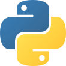
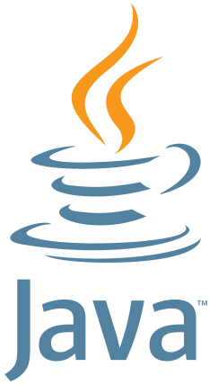

## Hi. I'm cal 🦧
I'm a software engineer with too much free time 🙈 \
Learn more about me on my [website](http://cal-overflow.dev) or [YouTube channel](https://www.youtube.com/channel/UCTfscxyX4CI9SnWdFqK4FJw).

- 💻 I'm currently developing a Multiplayer Pac-Man game titled [Pac-Man Overflow](https://github.com/cal-overflow/pacman-overflow) 👾
- 📚 I'm currently learning [Kubernetes](https://kubernetes.io/)
- 🎮 I'm probably playing Minecraft

  
Favorite technologies

  #### DevOps
  
  
  
  
  

  #### Frontend development
  
  
  
  
  

  #### Middleware & Backend development
  
  
  
  
  

  #### General
  
  
  
  
  

